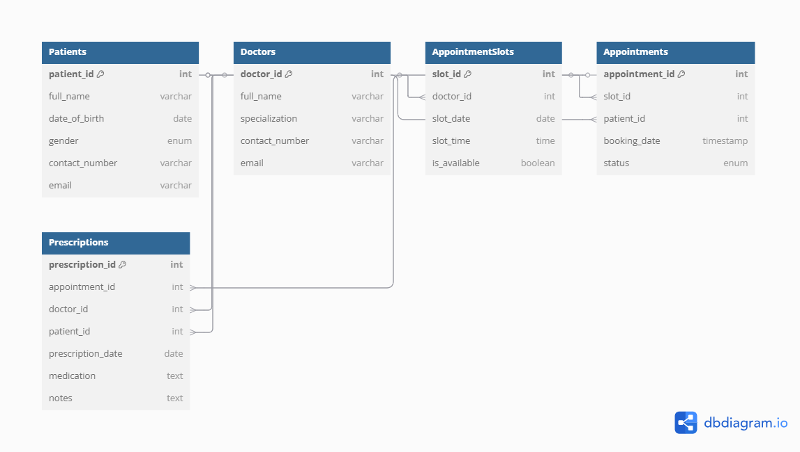

# **Clinical Booking System Database**

## Objective
This project involves designing an Entity Relationship Diagram (ERD) and building the
corresponding clinic booking system database from scratch. The goal is to create a relational 
database structure that supports registration of patients and doctors, booking of 
appointments, and storing prescriptions.

## Technologies Used
- MySQL: Database management system used for creating tables.
- dbdiagram.io: Tool used to create Entity Relationship Diagram (ERD).
- GitHub: Version control and collaborative development.

## Features
- Patient and doctor records.
- Appointment slot scheduling and booking.
- Prescription management.

## How to Run/ Setup the Project
1. Make sure MySQL is installed and running on your system.
2. Open your MySQL Workbench.
3. Import the provided `clinic_booking_system.sql` file to create the database schema.
Import via Command Line:
```bash
mysql -u your_username -p your_database < clinic_booking_system.sql
```

## Entity Relationship Diagram (ERD)



